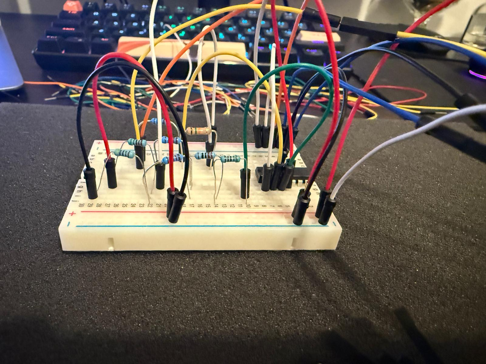
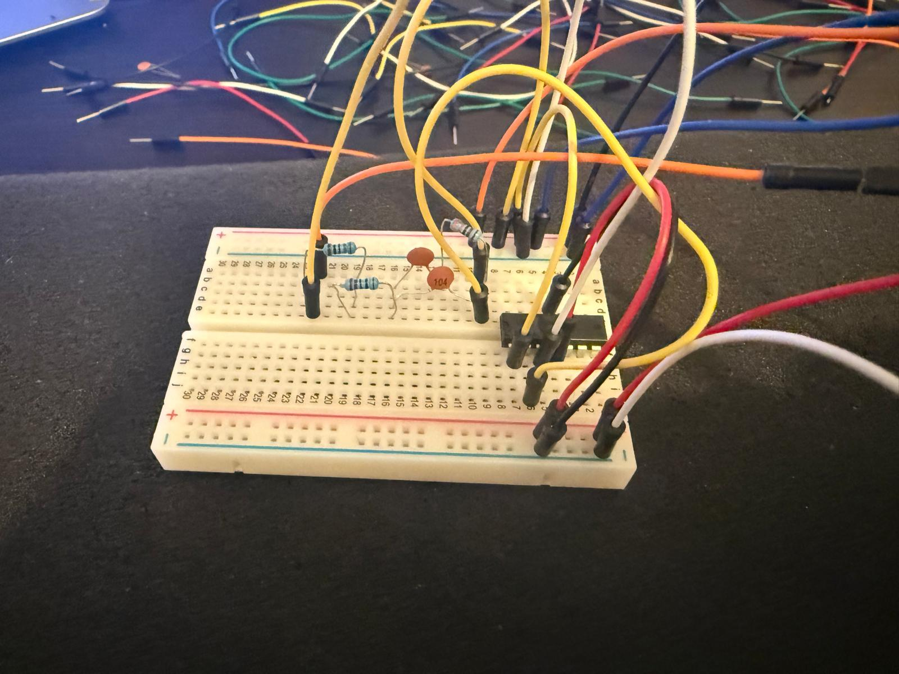
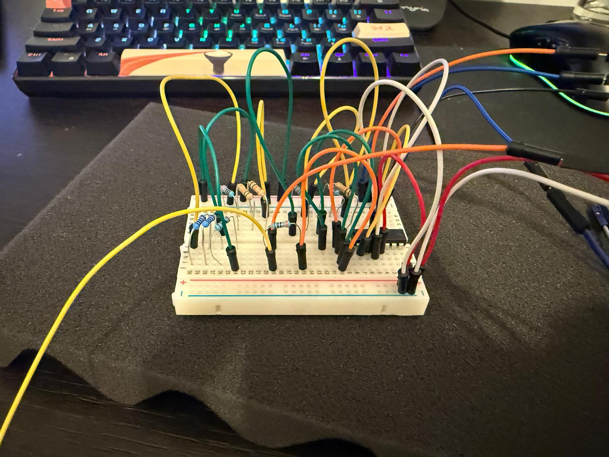

<h1 align="center">⚡ Sursă de Tensiune Stabilizată și Reglabilă</h1>
<h3 align="center">Proiect Sisteme cu Circuite Integrate Analogice (SCIA)</h3>

  
  
  

---

### 📝 Descriere Proiect
[cite_start]Acest proiect vizează proiectarea, simularea în **LTspice** și implementarea fizică a unei surse de tensiune stabilizate[cite: 5]. [cite_start]Sistemul este conceput să mențină o tensiune de ieșire constantă utilizând un circuit de reglare cu reacție[cite: 5].

Designul teoretic complet al proiectului este structurat pe **4 etaje principale**, toate fiind validate prin simulări CAD.

---

### 📂 Structură Repository (Ordonată)

Organizarea fișierelor reflectă structura modulară a proiectului:

- 📁 **`measurements_data/`**: Date brute colectate cu ADALM2000.
- 📁 **`ltspice_files/`**: Profile de simulare `.asc` pentru toate cele **4 etaje** ale circuitului.
- 📄 **`Raport Proiect SCIA Madarasan.pdf`**: Documentația tehnică detaliată.

---

### 🧪 Implementare Fizică și Validare
Deși proiectul cuprinde 4 etaje în faza de design, **implementarea fizică pe breadboard a fost realizată cu succes pentru primele 3 etaje principale**:

  
  
  

  <i>Fig. 1: Etaj 1 (Redresare/Filtrare) | Fig. 2: Etaj 2 (Referință) | Fig. 3: Etaj 3 (Reglaj Serie)</i>

> **Notă:** Etajul 4 a fost validat exclusiv prin simulări software în LTspice, în timp ce etapele 1-3 au fost confirmate prin măsurători reale folosind Scopy.

---

### 🛠️ Tehnologii și Unelte:

  
  
  

---

  <i>Realizat de Mădărășan Ioan-Alexandru</i>

